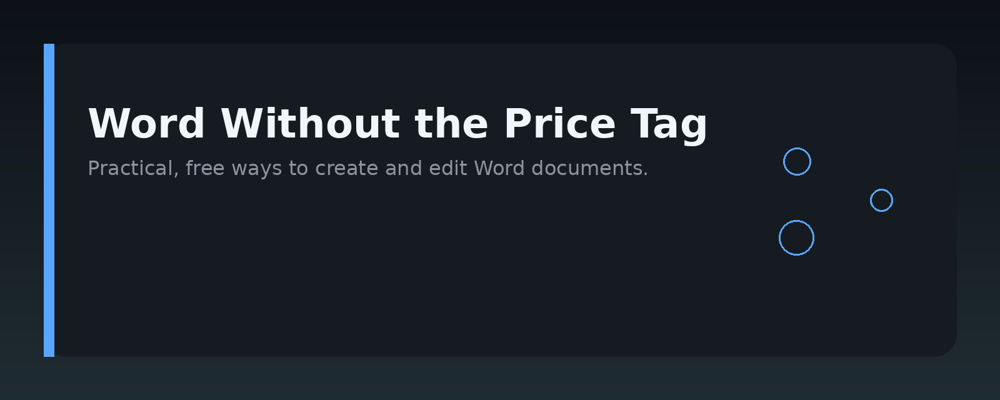
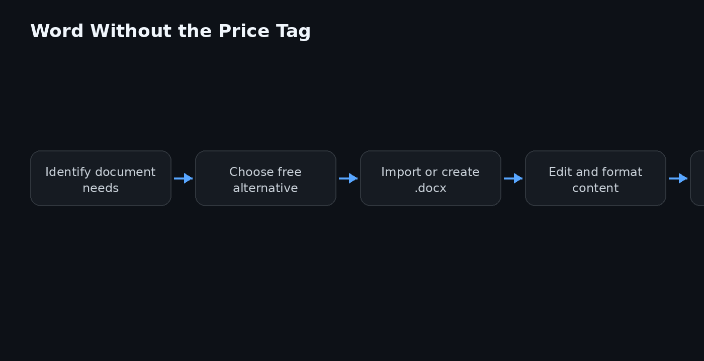

# Free Microsoft Word Alternatives and Document Tips




## Overview

This repository is a practical guide to working with documents without paying for Microsoft Word. It covers free Word alternatives, file-format compatibility, and workflow tips for anyone who needs to create, edit, or convert `.docx` files on a budget. Whether you are a student, a freelancer, or someone who simply does not want to buy a license, this guide helps you find a free Word alternative that fits your needs.

## Why it exists

Microsoft Word is the de facto standard for document exchange, but its subscription price is a barrier for many users. Free alternatives have matured significantly, yet people still struggle with compatibility, formatting loss, and collaboration. This repo consolidates tested solutions: which free Word alternatives work best for which tasks, how to avoid common pitfalls, and how to keep your documents portable. The goal is to give you a free Word replacement you can rely on without sacrificing quality.

## Core concepts

- **File format compatibility**: Understand `.docx`, `.doc`, `.odt`, and `.rtf`. Most free Word alternatives read and write `.docx`, but some handle complex formatting better than others.
- **Round-trip fidelity**: How well a tool preserves your original layout, styles, and embedded objects when you open and re-save a Word file.
- **Cloud vs. local**: Some free Word alternatives run in the browser, others are installed apps. Your choice affects offline access, privacy, and collaboration features.
- **Collaboration**: Real-time co-editing, comments, and version history are now standard in several free options.
- **Conversion workflows**: Moving between formats without losing content, including batch conversion and PDF export.

## Architecture

The repo is organized into three parts:

1. `docs/` — Markdown guides for each free Word alternative, including setup, strengths, and limitations.
2. `scripts/` — Small utilities for converting, validating, or cleaning up document files.
3. `examples/` — Sample documents and templates that show how to achieve specific results.

```
word-free-guide/
├── docs/
│   ├── libreoffice.md
│   ├── google-docs.md
│   ├── onlyoffice.md
│   └── wps-office.md
├── scripts/
│   ├── convert_to_docx.sh
│   └── check_compat.py
├── examples/
│   ├── resume_template.docx
│   └── report_template.odt
├── assets/
│   ├── banner.png
│   └── architecture.png
└── README.md
```

## Practical workflow

1. **Choose your free Word alternative** based on your main need: offline editing, collaboration, or maximum compatibility.
2. **Open your existing Word files** directly in the tool. Do not convert unless you hit a specific problem.
3. **Check formatting** after opening. If tables, headers, or footers shift, use the tool's "repair" or "recover" option, or try a different alternative.
4. **Collaborate** by sharing a link (cloud tools) or by using track changes (local tools).
5. **Export to PDF** for final distribution. This avoids any font or layout issues on the recipient's machine.
6. **Keep a backup** in `.docx` and one in an open format like `.odt` to stay future-proof.

## Examples

Below is a minimal Python script that checks whether a file is a valid `.docx` (a ZIP archive with the right structure). Run it from the `scripts/` folder.

```python
import zipfile
import sys

def is_docx(path):
    try:
        with zipfile.ZipFile(path) as z:
            return 'word/document.xml' in z.namelist()
    except (zipfile.BadZipFile, FileNotFoundError):
        return False

if __name__ == '__main__':
    print(is_docx(sys.argv[1]))
```

A simple shell command to batch-convert `.odt` files to `.docx` using LibreOffice:

```bash
for f in *.odt; do
  libreoffice --headless --convert-to docx "$f"
done
```

## FAQ

**Is there a completely free Microsoft Word alternative?**  
Yes. LibreOffice, Google Docs, OnlyOffice, and WPS Office all offer free tiers that handle `.docx` files well.

**Will my Word formatting survive in a free alternative?**  
Usually, but complex documents with macros, custom styles, or embedded objects may lose some fidelity. Always check the result after opening.

**Can I collaborate in real time without paying?**  
Google Docs and OnlyOffice (cloud version) support real-time collaboration for free. LibreOffice does not have native real-time co-editing.

**Do I need an internet connection?**  
Only for cloud-based tools. LibreOffice and WPS Office (desktop) work fully offline.

**What about macros and VBA?**  
LibreOffice supports a subset of VBA macros. Google Docs and WPS Office have limited or no VBA support.

**Is converting between formats safe?**  
Yes, but always keep the original file. Conversion can subtly change layout, so verify the output before sharing.

## License MIT

MIT License

Copyright (c) 2024 word-free-guide contributors

Permission is hereby granted, free of charge, to any person obtaining a copy of this software and associated documentation files (the "Software"), to deal in the Software without restriction, including without limitation the rights to use, copy, modify, merge, publish, distribute, sublicense, and/or sell copies of the Software, and to permit persons to whom the Software is furnished to do so, subject to the following conditions:

The above copyright notice and this permission notice shall be included in all copies or substantial portions of the Software.

THE SOFTWARE IS PROVIDED "AS IS", WITHOUT WARRANTY OF ANY KIND, EXPRESS OR IMPLIED, INCLUDING BUT NOT LIMITED TO THE WARRANTIES OF MERCHANTABILITY, FITNESS FOR A PARTICULAR PURPOSE AND NONINFRINGEMENT. IN NO EVENT SHALL THE AUTHORS OR COPYRIGHT HOLDERS BE LIABLE FOR ANY CLAIM, DAMAGES OR OTHER LIABILITY, WHETHER IN AN ACTION OF CONTRACT, TORT OR OTHERWISE, ARISING FROM, OUT OF OR IN CONNECTION WITH THE SOFTWARE OR THE USE OR OTHER DEALINGS IN THE SOFTWARE.

Topic: `word-document-tools`
